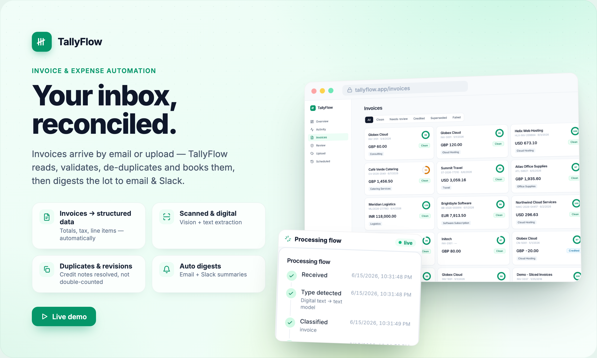
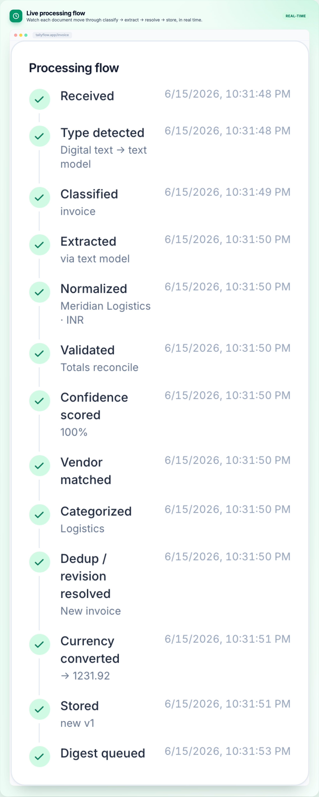
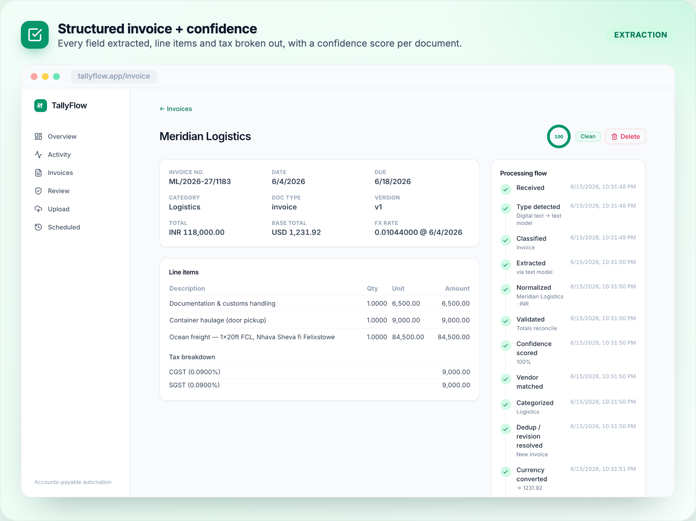
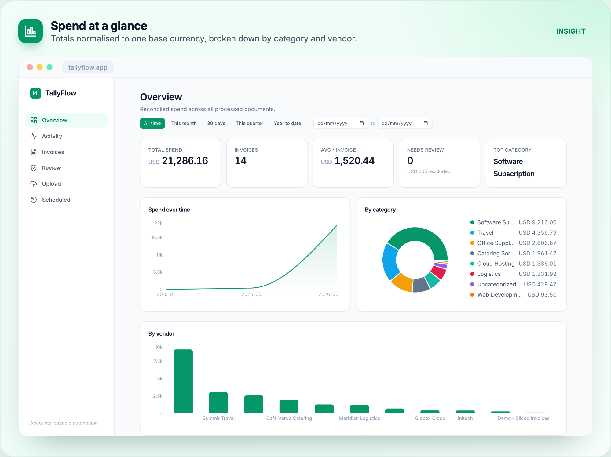
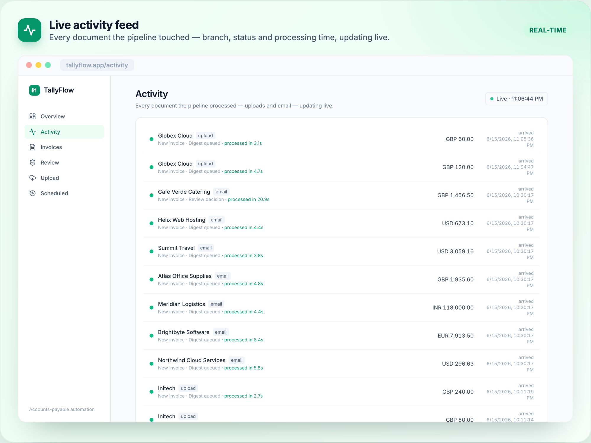
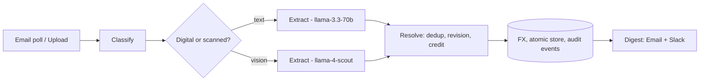

<div align="center">



<br/>

# TallyFlow

### Your inbox, reconciled.

Invoices arrive by email or upload — TallyFlow **reads, validates, de-duplicates and books** them, then digests the lot to email & Slack. An accounts-payable autopilot, built as a real tool, not a demo.

<br/>

[](https://tallyflow-api-944482736666.us-central1.run.app)


</div>

---

## What it does

Forward an invoice (or drop a PDF in the dashboard) and TallyFlow turns it into clean, structured, reconciled accounting data — handling the messy real world along the way: scanned **and** digital documents, duplicates, revisions, credit notes, multiple currencies and tax regimes. Anything uncertain is flagged for review; nothing is ever silently lost.

> **The hard part isn't extraction** (~10% of the value). It's the business logic: duplicates, revisions, credit notes, multi-currency, multi-tax, totals reconciliation, idempotency, and trust. That's what TallyFlow is built around.

---

## Design boundary (the important bit)

The LLM is used **only** to understand messy input — classify a document, extract its fields, suggest a category. **Every** money decision is deterministic code:

| The LLM does | Deterministic code does |
|---|---|
| Classify: invoice / credit note / non-invoice | All money math (never the model) |
| Extract fields into a strict schema | De-duplication, revision & credit resolution |
| Suggest an expense category | Currency conversion, multi-tax summation, totals reconciliation |

The model never decides a duplicate and never does arithmetic. Money is `Decimal` / `NUMERIC` end to end — never float. Model IDs live in one place (`backend/config.py`, env-overridable).

---

## Features

**See every document move through the pipeline, live.**
Classify → extract → resolve → store, streamed as each step completes.



**Structured data with a confidence score on every document.**
Vendor, dates, line items and tax broken out; multi-currency converted to a base; low-confidence docs route to review.



**Spend at a glance, normalised to one currency.**
Totals converted to a single base currency, broken down by category and vendor, with duplicates and credits already netted out.



**A live activity feed of everything processed.**
Branch, status and processing time per document — uploads and email alike, updating in real time.



---

## Architecture



Each stage emits an **event** — that stream is both the audit trail and the live-flow timeline. Writes are **atomic** (invoice + line items + tax + events commit together). The whole pipeline is **idempotent** by file hash + logical keys, so re-sending the same email never double-counts.

---

## What makes it real-world ready

Not a happy-path demo — these are the cases an AP tool actually hits:

| Scenario | How TallyFlow handles it |
|---|---|
| **Exact duplicate** | Same file re-sent → rejected by content hash, never stored twice |
| **Logical duplicate** | Same vendor + invoice number → linked, not double-counted |
| **Revision** | Updated invoice supersedes the prior version (within a tolerance band + date guard) |
| **Credit note** | Linked to its original and netted from spend; orphan credits flagged |
| **Multi-currency** | Converted to a base currency via live FX (USD/GBP/EUR/INR…) |
| **Multi-tax** | CGST + SGST (and friends) summed and reconciled to the tax total |
| **Totals don't reconcile** | Flagged `needs_review` instead of guessing |
| **Low confidence / ambiguous** | Routed to a human review queue |
| **Spam / promo email** | Dropped before the LLM (RFC bulk signals + heuristics) — no wasted calls |
| **Processing failure** | Transient → retried with backoff; permanent → dead-lettered with the original kept for replay |

Nothing is silently dropped, and nothing uncertain is silently trusted.

---

## Tech stack

| Layer | Stack |
|---|---|
| **Backend** | Python 3.11, FastAPI, pydantic v2, psycopg (pooled) |
| **AI** | Groq — `llama-3.3-70b` (text) + `llama-4-scout` (vision), extraction only |
| **Data** | Supabase Postgres (atomic RPC + Storage); SQLite for local dev |
| **Frontend** | React 18, TypeScript, Vite, TailwindCSS, Recharts |
| **Infra** | Cloud Run (API + dashboard, one image), Cloud Scheduler (hourly), GitHub Actions |
| **Integrations** | IMAP ingest, Slack webhook + email (Resend/SMTP) digests |

---

## Run locally

**Backend** (FastAPI + Groq; SQLite needs no extra services):
```bash
cd backend
python -m venv .venv && source .venv/bin/activate
pip install -r requirements.txt
cp ../.env.example ../.env        # add GROQ_API_KEY (Supabase optional; SQLite works with none)
uvicorn backend.main:app --reload --port 8000
```

**Dashboard** (React + Vite):
```bash
cd dashboard
npm install
echo "VITE_API_BASE=http://localhost:8000" > .env.local
npm run dev                        # http://localhost:5173
```

In production, hourly ingestion + digest run via **Cloud Scheduler → `/api/run`** (a GitHub Actions workflow is included as an alternative). Tests: `pytest backend/tests` (185 passing). Full build spec: [`AUTOMATION_BUILD_DOC.md`](AUTOMATION_BUILD_DOC.md).

---

## Repo layout

```
backend/      FastAPI app, pipeline, all deterministic modules (resolve, validate,
              normalize, fx, summary), store (SQLite + Postgres), tests
dashboard/    React + Vite dashboard (overview, invoices, detail + live flow,
              activity, review, upload, scheduled runs)
generator/    fictional invoice generators (synthetic test set + realistic PDFs)
assets/       README visuals (poster + feature-frame templates, export tooling)
```

<div align="center"><sub>Built with FastAPI · React · Supabase · Groq · Cloud Run</sub></div>
